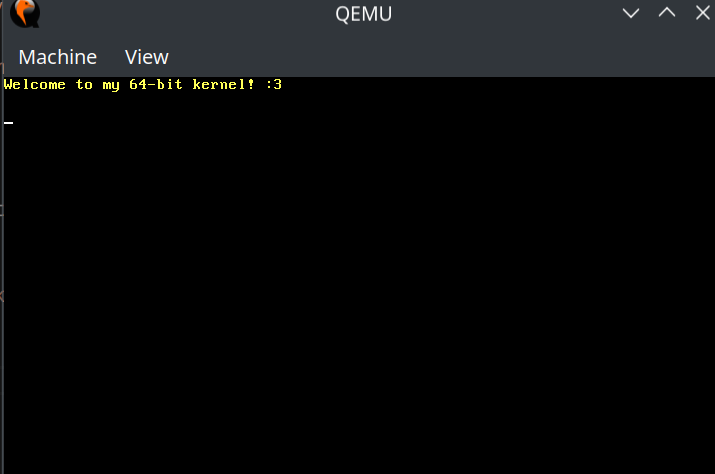

# 64-bit OS-Kernel

From: https://github.com/davidcallanan/os-series

Example of running it in qemu:

Building environment (in terminal)
Linux:          
- `sudo docker build buildenv -t myos-buildenv`
Windows:
- `docker build buildenv -t myos-buildenv`

Running container
Linux or Mac:
- `sudo docker run --rm -it -v $PWD:/root/env myos-buildenv`
Windows:
- `docker run --rm -it -v %cd%:/root/env myos-buildenv`

Making it
- `make build-x86_64`

*Have to exit out of container before testing in qemu

Running it in qemu
- `qemu-system-x86_64 -cdrom dist/x86_64/kernel.iso`

Clean Up
- `sudo docker rmi myos-buildenv -f`
- `docker rmi myos-buildenv -f`